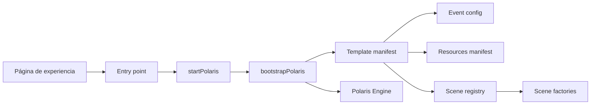

# Crear una plantilla Polaris

## Propósito

Una plantilla Polaris reúne configuración, recursos, escenas y navegación detrás de un
`template-manifest.js`. El motor consume ese contrato mediante sus APIs públicas y no
conoce el contenido de ninguna experiencia.

## Arquitectura y flujo



`startup.js` espera a que el DOM esté disponible. `bootstrap.js` hidrata contenido,
crea el motor, conserva `window.PolarisEngine` y publica
`window.startPolarisJourney`. El `SceneManager` registra el grafo; los controladores
públicos coordinan transiciones, autoplay y audio.

## Crear con la CLI

Desde la raíz del repositorio:

```bash
node scripts/create-template.mjs my-event
# o
npm run create-template -- my-event
```

El nombre debe estar en `kebab-case`. La CLI falla sin sobrescribir si el destino ya
existe. Genera:

```text
src/scripts/templates/my-event/
├── config/event-config.js
├── scenes/
│   ├── create-scene.js
│   ├── opening-scene.js
│   ├── message-scene.js
│   └── closing-scene.js
├── resources-manifest.js
├── scene-registry.js
├── template-manifest.js
└── README.md
```

## Personalización

1. Editar `config/event-config.js` con datos públicos y textos autorizados.
2. Declarar recursos propios, relativos o embebidos en `resources-manifest.js`.
3. Crear el marcado cuyos valores `data-scene` coincidan con el registro.
4. Adaptar escenas usando únicamente el contexto entregado por `SceneManager`.
5. Configurar escena inicial, destino de inicio, transiciones, autoplay y audio en el
   manifiesto.
6. Crear una ruta estática bajo `experiences/<slug>/` con su entry point.
7. Registrar la experiencia en `src/scripts/templates/index.js`.

## Registro único

`src/scripts/templates/index.js` es la fuente central de Polaris Showcase. Cada
entrada contiene `id`, nombre, descripción, imagen, URL pública y manifiesto. No se
debe añadir la misma experiencia en ninguna lista del Showcase.

## Contratos que no se deben romper

- El registro es un arreglo ordenado de `{ id, create, nextSceneId }`.
- Cada fábrica devuelve una escena con `id` y hooks públicos como `init`, `enter` y
  `exit`.
- `runtime` define `initialSceneId`, `journeySceneId`, `transitionMs`, `autoplay` y
  `audio`.
- Todas las rutas deben ser relativas, POSIX y compatibles con GitHub Pages.
- Una plantilla no modifica ni importa internals de `src/scripts/polaris/`.

## Checklist

1. Validar sintaxis JavaScript y UTF-8.
2. Confirmar IDs únicos y destinos existentes.
3. Recorrer inicio, siguiente, anterior y cierre.
4. Verificar autoplay y su escena de parada.
5. Probar degradación de audio y transiciones.
6. Revisar viewport móvil y reducción de movimiento.
7. Servir el repositorio bajo `/baby-shower-space/` para comprobar rutas Pages.
8. Confirmar que Baby Shower Space y Template Starter no cambiaron.
