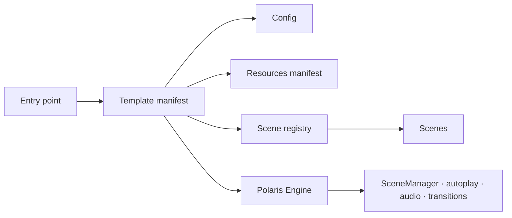

# Crear una plantilla Polaris

## Propósito

Una plantilla Polaris define una experiencia sin cambiar el motor. Reúne su contenido,
recursos, opciones de ejecución, escenas y grafo de navegación detrás de un único
`template-manifest.js`.

`template-starter` es la referencia mínima. No reemplaza la experiencia publicada ni
se importa desde `src/scripts/main.js`; existe para demostrar y validar el contrato de
plantillas de forma aislada.

## Arquitectura



Las dependencias apuntan hacia el motor mediante sus APIs públicas. El motor no
importa plantillas, configuración de eventos, escenas ni recursos concretos.

## Estructura mínima

```text
src/scripts/templates/<template-name>/
├── config/
│   └── event-config.js
├── scenes/
│   ├── opening-scene.js
│   ├── message-scene.js
│   └── closing-scene.js
├── resources-manifest.js
├── scene-registry.js
└── template-manifest.js
```

El marcado y los estilos que una experiencia publicable necesite también pertenecen a
la plantilla. Su ubicación y su ruta pública deben acordarse antes de conectarlos al
entry point, porque esa decisión puede afectar la publicación existente.

## Archivos que se deben copiar

1. Copiar `src/scripts/templates/template-starter/` con un nombre único en
   `src/scripts/templates/`.
2. Mantener los cinco contratos: configuración, manifiesto de recursos, registro de
   escenas, manifiesto de plantilla y fábricas de escenas.
3. Copiar únicamente el marcado y los estilos aprobados para la nueva experiencia; no
   copiar contenido ni recursos de otra plantilla por defecto.

## Archivos que se deben editar

### `config/event-config.js`

Definir los metadatos y el contenido de la experiencia. `document` contiene `title`,
`description` y `ariaLabel`; `content` contiene las claves que el bootstrap hidrata en
elementos con `data-event-field`.

### `resources-manifest.js`

Declarar recursos propios y sus opciones. La configuración de audio debe ofrecer
`src` y `volume`. Registrar solo rutas relativas versionadas o recursos embebidos
aprobados, sin rutas personales, secretos ni dependencias de una computadora local.

### `scenes/*.js`

Implementar una fábrica por escena. Cada fábrica devuelve el contrato que consume
`SceneManager`: `id` y los hooks necesarios (`init`, `enter`, `exit` u
`onMissingNextScene`). Las escenas navegan mediante el `sceneManager` recibido en
`init`; no deben importar internals del motor.

### `scene-registry.js`

Importar las fábricas y declarar el grafo en orden. Cada entrada contiene `id`,
`create` y `nextSceneId`. Los IDs deben ser únicos, coincidir con `data-scene` en el
marcado y formar una secuencia alcanzable.

### `template-manifest.js`

Componer los contratos anteriores y configurar:

- `initialSceneId`: primera escena visible;
- `journeySceneId`: destino de la acción de inicio;
- `transitionMs`: duración coordinada de transición;
- `autoplay`: espera, reintento y escena de parada;
- `audio`: referencia al audio declarado por la plantilla.

El objeto exportado es la única entrada que necesita `bootstrapPolaris`.

## Archivos que no se deben tocar

No modificar para crear una plantilla:

- `src/scripts/polaris/`;
- `src/scripts/core/scene-manager.js`;
- los directorios de otras plantillas;
- `src/scripts/main.js`, `index.html` o los estilos publicados hasta que exista una
  tarea aprobada para seleccionar o publicar la nueva experiencia.

Si una plantilla no puede construirse con las APIs públicas, se debe detener el
trabajo, documentar el defecto arquitectónico y solicitar revisión antes de proponer
el cambio mínimo al motor.

## Conectar una plantilla aprobada

Una vez aprobados su marcado, estilos y ruta pública, el entry point puede importar su
manifiesto y pasarlo sin transformaciones al bootstrap:

```js
import { bootstrapPolaris } from "./polaris/bootstrap.js";
import { startPolaris } from "./polaris/startup.js";
import { myTemplate } from "./templates/my-template/template-manifest.js";

startPolaris(() => bootstrapPolaris(myTemplate));
```

No se debe cambiar el entry point de producción solo para probar una plantilla. Las
pruebas aisladas deben importar directamente el manifiesto nuevo.

## Lista de verificación

1. Confirmar que el motor no contiene imports ni nombres de la nueva plantilla.
2. Validar sintaxis, UTF-8, rutas relativas y capitalización.
3. Verificar que configuración y recursos sean propios.
4. Validar IDs, orden, enlaces y escena final del registro.
5. Recorrer bootstrap, navegación siguiente/anterior, autoplay y escena de parada.
6. Verificar transiciones, degradación del audio y APIs públicas.
7. Revisar el flujo completo en móvil antes de publicar.
8. Inspeccionar el diff y confirmar que la experiencia activa no cambió.
