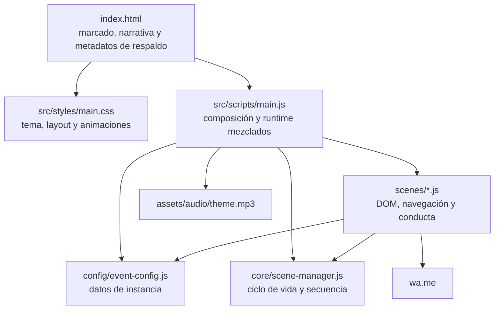
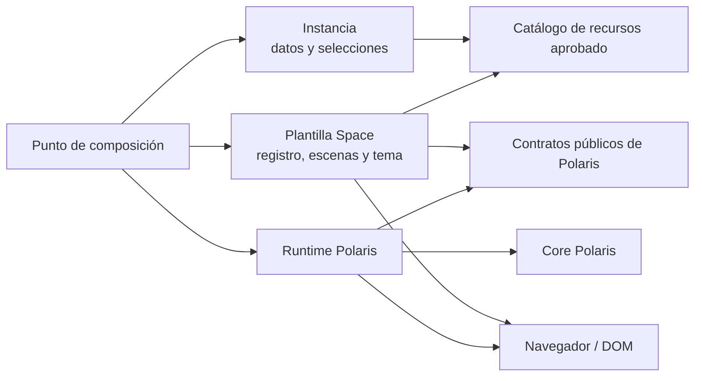
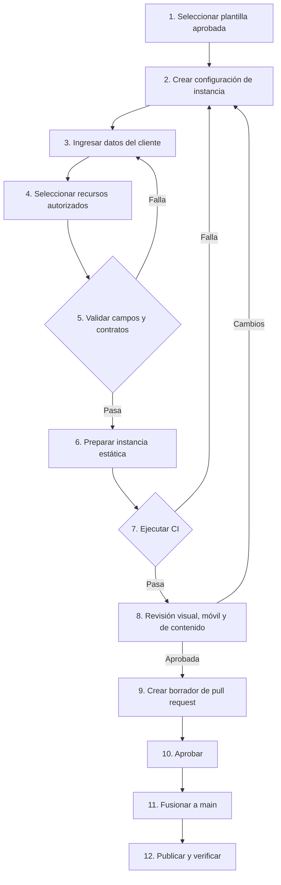

# Arquitectura reutilizable de Polaris

## 1. Resumen ejecutivo

Baby Shower Space es hoy una aplicación web estática, autocontenida y sin dependencias de ejecución, pero todavía no está separada como producto reutilizable. `src/scripts/main.js` concentra inicialización, composición de escenas, transiciones, autoplay, pausa por presión, audio, manejo de errores, publicación de estado global e hidratación de la instancia. Los controladores de escenas combinan ciclo de vida, selectores del DOM, animación y navegación; uno de ellos también importa directamente datos del cliente. `index.html` y `src/styles/main.css` contienen simultáneamente estructura narrativa, tema visual y contratos implícitos con JavaScript.

La recomendación es evolucionar de forma incremental hacia tres límites principales:

1. **Motor Polaris:** mecanismos generales que no conocen una historia, un cliente ni assets concretos.
2. **Plantilla Baby Shower Space:** narrativa espacial, catálogo y orden dramático de escenas, marcado, tema, animaciones, textos estables y recursos predeterminados.
3. **Instancia:** datos públicos de un evento, metadatos, enlaces y elecciones aprobadas dentro de las capacidades de la plantilla.

Los recursos se describirían mediante un manifiesto declarativo de plantilla con sustituciones permitidas explícitamente; el registro declarativo de escenas compondría la plantilla sin codificar imports, IDs, orden ni tiempos en el punto de entrada. Esta tarea define los contratos, pero no los implementa. La versión publicada debe permanecer sin cambios durante una migración pequeña, reversible y respaldada por pruebas de caracterización.

## 2. Estado actual

### 2.1 Topología

La aplicación se publica directamente desde la raíz y no tiene build, gestor de paquetes, framework, variables de entorno ni servicios propios. `index.html` carga `src/styles/main.css` y el módulo `src/scripts/main.js` mediante rutas relativas compatibles con el subdirectorio de GitHub Pages. El runtime usa módulos ES nativos y un audio versionado. WhatsApp es el único enlace externo consumido por una interacción; Google Maps está configurado, pero no se usa actualmente.



### 2.2 Flujo de ejecución

1. `main.js` espera `DOMContentLoaded` cuando es necesario.
2. `applyEventConfig()` actualiza metadatos y los nodos `data-event-field`.
3. Se crean `SceneManager`, autoplay y audio.
4. Ocho fábricas se crean y registran en orden; `celebration-scene.js` queda fuera.
5. `showScene()` se decora en runtime para añadir transiciones cinematográficas.
6. Se expone `window.PolarisEngine`, se enlaza la pausa por presión y se instala `window.startPolarisJourney`.
7. Se abre `opening`; la interacción inicial inicia música, avanza a `benjamin` y activa autoplay.
8. Autoplay avanza cada 4 segundos y se detiene al llegar a `scene8` (RSVP).

### 2.3 Escenas activas

El registro efectivo es `opening → benjamin → signal → star → scene6 → scene7 → scene8 → scene9`. El orden de registro también sirve como respaldo para la navegación adyacente. Cada controlador declara además `nextSceneId`, salvo el cierre. Los IDs mezclan nombres semánticos con números históricos, y falta `scene5` en el marcado y el registro pese a existir su controlador y estilos.

## 3. Inventario arquitectónico

La clasificación indica el destino conceptual, no autoriza movimientos ni cambios funcionales.

| Elemento auditado | Responsabilidad actual | Clasificación | Destino recomendado |
| --- | --- | --- | --- |
| `src/scripts/main.js` | Importa configuración, motor y escenas; define IDs, tiempos, transiciones, autoplay, presión, audio, fallbacks, hidratación, bootstrap y estado global. | Deuda técnica por mezcla; sus mecanismos son motor reutilizable y su composición es plantilla/configuración. | Reducirlo en el futuro a un punto de entrada que recibe contratos ya validados. |
| `src/scripts/core/scene-manager.js` | Registra escenas, conserva secuencia y estados, bloquea concurrencia, navega, crea contexto y ejecuta hooks de entrada/salida. | Motor reutilizable. | `src/polaris/core/scene-manager.js`, preservando primero su API observable. |
| `src/scripts/scenes/*.js` activos | Seleccionan DOM, enlazan acciones, muestran/ocultan escenas y activan `is-revealed`; declaran IDs y siguiente escena. | Plantilla Baby Shower Space; la forma del ciclo de vida pertenece al contrato del motor. | `src/templates/space/scenes/`, recibiendo servicios y datos resueltos por contexto. |
| `opening-scene.js` | Inicio, estados accesibles, navegación defensiva, fallback interactivo y texto heredado del MVP. | Plantilla + deuda técnica; parte del manejo de errores es motor. | Conservar conducta durante migración; después separar política visual de recuperación general. |
| `rsvp-scene.js` | Importa configuración, genera URL de WhatsApp, muta datasets, abre una pestaña y avanza. | Integración de instancia + conducta de plantilla + deuda técnica. | Un servicio/adaptador RSVP recibe datos validados; la escena solo solicita la acción mediante contexto. |
| Registro y orden | Imports y ocho llamadas manuales en `main.js`; `nextSceneId` repetido en controladores; `sequence` depende del orden de registro. | Plantilla Baby Shower Space + deuda técnica. | Registro declarativo único, validado antes del bootstrap. |
| Navegación | `SceneManager` implementa directa, siguiente y anterior; escenas llaman `nextScene()`; el inicio suma dos fallbacks y uno de DOM. | Motor reutilizable; política de avance y fallback visual son plantilla/deuda. | Servicio de navegación del runtime con capacidades y errores tipados; escenas usan contexto. |
| Autoplay | Temporizador fijo de 4 s, reintento de 120 ms durante transición y parada codificada en `scene8`. | Motor reutilizable con opciones específicas de plantilla codificadas. | Controlador del runtime; habilitación, duración y parada se declaran por escena/plantilla. |
| Pausa mediante presión | Eventos pointer y touch globales pausan/reanudan el temporizador conservando el tiempo restante. | Motor reutilizable + deuda técnica parcial. | Servicio transversal que evite eventos duplicados y contemple teclado, visibilidad y cancelación. |
| Audio y volumen | `Audio`, loop, preload, volumen `0.2`, ruta y degradación silenciosa en `main.js`; solo ofrece `start`. | Reproducción: motor. Política, pista y volumen: plantilla/recurso configurable. | Controlador de audio con `start`, `pause`, `resume`, `stop`, estado, errores y preferencias de usuario. |
| Tiempos y transiciones | 600 ms globales en `main.js`; 1700/2000 ms y 120 ms en apertura; tiempos de animación dispersos en CSS; autoplay 4000 ms. | Motor + plantilla + deuda técnica. | Motor ejecuta; registro y configuración de plantilla definen; CSS conserva duración visual coordinada por tokens. |
| Contenido narrativo | Textos estables y estructura en `index.html`; personalizados en `eventConfig.content`; texto MVP duplicado entre HTML y apertura. | Plantilla, configuración de instancia y deuda técnica por duplicación. | Esquema de contenido distingue claves estables, personalizables y derivadas. |
| Datos del cliente | `event-config.js`: bebé, anfitriones, fecha, hora, lugar, RSVP, regalos, contenido derivado y documento. | Configuración de instancia; `document` incluye valores hoy ligados a la marca de plantilla. | Una instancia validada, sin importación directa desde escenas. |
| Metadatos | Respaldos estáticos en HTML, valores runtime en `eventConfig.document` y validación exacta en CI. | Configuración de instancia + infraestructura/validación; HTML debe permanecer sin cambios ahora. | Mantener respaldos generables/validables para crawlers y ejecución sin JS. |
| Estilos y tema | Un único CSS define tokens, layout, escena, tema espacial, animaciones, responsive y `prefers-reduced-motion`. | Plantilla Baby Shower Space; reducción de movimiento es accesibilidad transversal. | Estilos de plantilla con tokens; el motor solo define estados/contratos mínimos si son necesarios. |
| Multimedia | `assets/audio/theme.mp3` activo; directorios reservados para imágenes, video, iconos y branding. Visuales actuales son CSS/HTML. | Audio: recurso predeterminado de plantilla y configurable solo si se aprueba. Reservas: infraestructura. | Manifiesto declarativo, con allowlist por plantilla y presupuesto móvil. |
| Enlaces externos | `wa.me` se construye en RSVP; Google Maps existe en configuración sin consumidor; README contiene URL local solo documental. | Instancia + integración de plantilla; Google Maps es parcialmente utilizado. | Validar protocolo/dominio y exponer servicios por capacidad, nunca URLs arbitrarias al motor. |
| GitHub Actions | Sintaxis JS, sincronía de metadatos, UTF-8/rutas/capitalización/secretos, referencias locales y prueba HTTP bajo subdirectorio. | Infraestructura o validación; debe permanecer sin cambios en esta tarea. | Extender en fases futuras con validación de contratos y recursos, sin sustituir controles actuales. |
| GitHub Pages | Publicación estática desde raíz, configurada fuera del repositorio y documentada como manual. | Infraestructura; debe permanecer sin cambios. | Conservar rutas relativas, ausencia de build obligatoria y entrada raíz. |
| `celebration-scene.js` y selectores `.scene-celebration` | Controlador no importado, sin sección HTML; estilos aún presentes. | Código sin uso / deuda técnica; posiblemente diseño futuro. | No eliminar sin decisión creativa; registrar como escena disponible solo si existe marcado aprobado. |
| Google Maps | URL válida almacenada pero no renderizada ni abierta. | Código/dato parcialmente utilizado. | Mantener como capacidad opcional; no prometer ubicación interactiva hasta que una plantilla la consuma. |
| `previousScene()` | API implementada, sin controles activos que la invoquen. | Motor reutilizable parcialmente utilizado. | Conservar y cubrir por pruebas; decidir después si la plantilla habilita reversibilidad. |
| `showTemporaryMvpState()` y mensaje MVP | Fallback de una etapa antigua aunque ya hay recorrido de ocho escenas. | Deuda técnica y elemento publicado que debe permanecer sin cambios hasta autorización. | Caracterizar primero; retirar o rediseñar solo en tarea UX aprobada. |
| Botones `hidden` de continuidad | Existen y tienen listeners, pero varios permanecen ocultos; autoplay conduce el flujo. | Plantilla parcialmente utilizada. | Declarar navegación manual como capacidad y decidir su presentación con Product Owner. |
| `window.PolarisEngine` y `window.startPolarisJourney` | API global de depuración/compatibilidad e integración con `onclick`. | Deuda técnica y compatibilidad publicada. | Mantener como adaptador temporal; no convertirlo en contrato permanente sin decisión explícita. |

### 3.1 Responsabilidades concretas de `SceneManager`

- Mantener un mapa de escenas, una secuencia de registro, la escena activa y estados por escena.
- Rechazar IDs ausentes o duplicados al registrar.
- Invocar `init` al registrar y los hooks `beforeEnter`, `enter`/`show`, `afterEnter`, `beforeExit`, `exit`/`hide`, `afterExit` al navegar.
- Serializar transiciones con estado `transitioning` y notificar bloqueos o escenas ausentes mediante callbacks opcionales.
- Resolver `nextSceneId` de la escena o recurrir a adyacencia; resolver retroceso solo por adyacencia.
- Exponer consultas de escena, estado y transición.

No controla hoy la duración visual, audio, autoplay, accesibilidad global, historial, limpieza de listeners, cancelación, rollback ante errores ni validación completa del grafo.

### 3.2 Elementos que deben permanecer sin cambios durante la migración

- Aspecto, narrativa, música, orden observable, ritmos, interacción, enlaces y fallbacks de la experiencia publicada.
- Datos de Benjamín, Daniel y Ana Josse y del evento hasta autorización de contenido.
- Contratos DOM (`data-scene`, `data-event-field`, botones y clases) mientras no existan pruebas de caracterización.
- Rutas públicas, query strings de caché y publicación en la raíz para GitHub Pages.
- Workflow y fuente de Pages salvo tareas específicas aprobadas.
- Exposición pública actual de datos y enlaces, sin ampliarla.

## 4. Problemas detectados

1. **Punto de entrada sobredimensionado.** `main.js` es composición, motor, adaptador DOM, controlador de audio, temporizador, recuperación e hidratador.
2. **Dependencias invertidas.** La escena RSVP depende directamente de la instancia; la plantilla conoce detalles que deberían llegar mediante puertos o contexto.
3. **Registro duplicado y frágil.** Imports, creación, orden y enlaces `nextSceneId` se reparten entre `main.js` y cada controlador, permitiendo divergencias.
4. **IDs inconsistentes.** Se mezclan `opening`, `benjamin`, `signal`, `star` y `scene6`–`scene9`; la ausencia de `scene5` no se detecta automáticamente.
5. **Políticas codificadas.** La parada del autoplay conoce `scene8`; el motor conoce la pista y su volumen; el inicio conoce a Benjamín por nombre de ID.
6. **Ciclo de vida incompleto.** `init` agrega listeners sin mecanismo de destrucción; un segundo bootstrap podría duplicar acciones.
7. **Manejo de errores distribuido.** Hay callbacks, `catch` silenciosos, fallbacks directos al DOM y mensajes dentro de la plantilla, sin telemetría ni política uniforme.
8. **Estado global implícito.** `window.PolarisEngine`, `window.startPolarisJourney`, datasets mutados, atributos y clases DOM actúan como fuentes de estado paralelas.
9. **Temporización dispersa.** JavaScript y CSS comparten ritmos sin un contrato que asegure sincronía; la reducción de movimiento no reajusta el temporizador narrativo.
10. **Accesibilidad parcial.** Hay semántica, región viva y reducción de movimiento, pero no una gestión transversal documentada de foco, teclado, anuncios, pausa o preferencias.
11. **Recursos sin contrato.** No hay inventario legible por máquinas, tipo, dimensiones, peso, licencia, variante, fallback ni allowlist.
12. **Configuración sin esquema.** CI sincroniza tres metadatos, pero no valida campos obligatorios, formatos de teléfono/URL, claves de contenido ni compatibilidad con la plantilla.
13. **Código parcial o heredado.** Celebration no está activa; Maps no tiene consumidor; retroceso no tiene UI; varios botones están ocultos; el mensaje MVP está duplicado.
14. **Documentación desactualizada.** README describe solo dos escenas y afirma que RSVP, regalos y música no están incluidos, aunque el runtime actual sí los contiene.
15. **Revisión visual no automatizada.** CI prueba recursos por HTTP, pero no render, recorrido real, consola, foco, enlaces ni viewport móvil.

## 5. Separación entre motor, plantilla e instancia

### 5.1 Motor Polaris

El motor debe contener mecanismos estables y agnósticos de contenido:

- `SceneManager` y validación del ciclo de vida.
- Registro interno, navegación directa/anterior/siguiente y resolución del grafo recibido.
- Ejecución y coordinación de transiciones sin imponer una estética.
- Control de reproducción de audio mediante una descripción de recurso ya validada.
- Autoplay, pausa, reanudación, parada y conservación del tiempo restante.
- Estado explícito de runtime: escena, transición, reproducción, pausa, error y capacidades.
- Accesibilidad transversal: foco, anuncios, teclado, reducción de movimiento y controles de pausa.
- Manejo de errores con categorías, fallback seguro y mensajes proporcionados por la plantilla.
- Inicialización idempotente y destrucción de listeners/temporizadores.

El motor **no debe** importar `event-config.js`, HTML o CSS de Space, controladores concretos, textos, nombres de escena creativos, URLs de terceros ni rutas de assets predeterminados.

### 5.2 Plantilla Baby Shower Space

La plantilla debe definir la experiencia creativa aprobada:

- Narrativa, orden dramático y catálogo de escenas disponibles.
- Marcado, textos estables, botones y affordances.
- Controladores/adaptadores DOM de cada escena.
- Tema espacial, estilos, tokens creativos, animaciones y transiciones visuales.
- Política narrativa de autoplay y tiempos por escena.
- Capacidades admitidas: RSVP por WhatsApp, regalos, ubicación, música u otras aprobadas.
- Recursos predeterminados y alternativas autorizadas.
- Mensajes de error con tono de la experiencia.

La plantilla puede depender de contratos públicos del motor y de un objeto de instancia validado. No puede importar internals del runtime ni una instancia concreta.

### 5.3 Instancia

La instancia debe ser declarativa y contener únicamente variaciones autorizadas:

- Datos del cliente, anfitriones y persona celebrada.
- Tipo, fecha, hora y ubicación del evento.
- Metadatos del documento y vista previa cuando se aprueban.
- Configuración RSVP, regalos, ubicación y enlaces.
- Textos marcados por la plantilla como personalizables.
- Selección de recursos y variantes incluidas en la allowlist de la plantilla.

La instancia no contiene funciones, selectores DOM, IDs de escena, tiempos internos del motor, CSS arbitrario, HTML, secretos ni URLs de assets fuera de las políticas aprobadas.

### 5.4 Recursos configurables

Los archivos binarios y fuentes son una cuarta dimensión de composición. Pertenecen a la plantilla por defecto; una instancia solo puede seleccionar una clave autorizada. La ruta física se resuelve después de validar esa clave, para impedir que datos de cliente introduzcan rutas locales o recursos externos.

## 6. Arquitectura objetivo

### 6.1 Estructura conceptual evaluada

Los nombres sugeridos son adecuados como dirección, con estos ajustes:

```text
src/
  polaris/
    core/                 # contratos y mecanismos puros o agnósticos del DOM creativo
    runtime/              # bootstrap web, estado, audio, autoplay, accesibilidad y errores
  templates/
    space/
      scenes/             # controladores y vistas de la narrativa Space
      scene-registry.js   # grafo y políticas narrativas
      template-config.js  # capacidades, textos estables, transiciones y defaults
      assets-manifest.js  # catálogo/allowlist declarativo de recursos
      styles/              # estilos y tema de plantilla, en una fase aprobada
  instances/
    event-config.js       # instancia concreta, o subcarpeta por slug si coexisten varias
  scripts/
    main.js               # punto de composición mínimo compatible con Pages
```

`src/polaris/core/` y `src/polaris/runtime/` evitan mezclar reglas puras con APIs web. `src/templates/space/` es preferible a `src/scripts/scenes/` cuando exista más de una plantilla. `src/instances/event-config.js` es suficiente para una sola publicación; si varias instancias deben coexistir en un repositorio, la decisión de URLs y despliegue debe preceder una estructura por slug. No se crean estas carpetas en POLARIS-002.

### 6.2 Mapeo de archivos actuales

| Archivo actual | Capa futura principal | Extracciones conceptuales |
| --- | --- | --- |
| `src/scripts/core/scene-manager.js` | `polaris/core` | Contrato de escena, validación de registro y grafo. |
| `src/scripts/main.js` | `polaris/runtime` + composición | Transición, autoplay, hold, audio, errores, hidratación y bootstrap se separan; imports concretos salen al registro. |
| `src/scripts/scenes/*.js` | `templates/space/scenes` | Los datos e integraciones se reciben por contexto; IDs pasan al registro. |
| `src/scripts/config/event-config.js` | `instances` | Datos de instancia; defaults y textos estables salen a template config. |
| `index.html` | Plantilla + shell de publicación | El shell permanece en raíz; las secciones representan vistas de Space y los respaldos representan instancia. |
| `src/styles/main.css` | Plantilla Space | Tema, layout y animación; reglas transversales de accesibilidad se coordinan con runtime. |
| `assets/audio/theme.mp3` | Recursos de plantilla | Clave declarada en el manifiesto y seleccionable solo si la plantilla lo permite. |
| `.github/*` | Infraestructura/validación | Validación futura de contratos, instancia, manifiesto, rutas y render. |

### 6.3 Dependencias permitidas y prohibidas



Dependencias permitidas:

- `core` depende solo de contratos y primitivas del lenguaje.
- `runtime` depende de `core` y adaptadores web explícitos.
- la plantilla depende de contratos públicos del motor, nunca de sus internals;
- la instancia depende de un esquema público de plantilla solo para conocer claves y opciones admitidas;
- el punto de composición importa una plantilla, una instancia y el bootstrap;
- CI puede importar contratos, plantilla e instancia para validarlos.

Dependencias prohibidas:

- motor → plantilla, instancia, nombre del bebé, WhatsApp, tema o asset físico;
- plantilla → una instancia concreta o constantes de cliente;
- escena → `event-config.js`, `window.PolarisEngine` o internals de `SceneManager`;
- instancia → DOM, controladores, CSS, funciones o rutas libres;
- manifiesto → rutas absolutas/locales, recursos remotos no aprobados o secretos;
- módulo reutilizable → `index.html` concreto salvo mediante un adaptador de plantilla.

### 6.4 Inversión de datos y servicios

Para evitar que el motor conozca “Benjamín”, el bootstrap valida y compone `template + instance`; entrega al runtime solo estructuras abstractas (`sceneRegistry`, `runtimeOptions`, `assets`) y entrega a la plantilla contenido resuelto. El motor opera con IDs opacos y nunca inspecciona textos.

Para evitar que los controladores conozcan datos del cliente, cada fábrica recibe un contexto limitado:

- `content`: valores ya resueltos para los slots de esa escena;
- `navigation`: comandos públicos;
- `services`: capacidades autorizadas, por ejemplo `rsvp.respond(choice)`;
- `motion` y `accessibility`: preferencias y helpers;
- `root`: elemento raíz resuelto por el adaptador, si se adopta inyección DOM.

La escena RSVP no construye teléfonos ni URLs; solicita al servicio configurado responder “yes” o “no”. La escena de coordenadas no lee la instancia completa; recibe los campos que su plantilla declaró.

### 6.5 Compatibilidad con GitHub Pages

- Mantener `index.html` en la raíz y un módulo de entrada accesible por ruta relativa.
- Usar únicamente módulos ES nativos y assets versionados; no exigir build.
- Resolver rutas respecto del documento o mediante URLs relativas, nunca con `/` inicial.
- Conservar respaldos estáticos de metadatos y su validación mientras el contenido se aplique en runtime.
- Validar desde `/baby-shower-space/` como hace el workflow actual.
- No introducir imports dinámicos dependientes de servidor, history routing, endpoints, variables de entorno ni rutas generadas en una máquina local.
- Si en el futuro un generador produce archivos, sus resultados estáticos deben versionarse o generarse de forma reproducible antes de Pages; el runtime publicado seguirá sin dependencias.

### 6.6 Estado, accesibilidad y errores

El runtime debe mantener una única instantánea observable, al menos con `lifecycle`, `currentSceneId`, `transition`, `autoplay`, `audio`, `interactionPause` y `error`. Los atributos DOM reflejan ese estado; no lo reemplazan.

El contrato transversal debe contemplar foco al cambiar de escena, región viva sin mensajes duplicados, navegación por teclado, controles con área táctil suficiente, `prefers-reduced-motion`, pausa explícita y degradación cuando audio o enlaces externos no estén disponibles. Reducir movimiento debe evitar esperas visuales innecesarias sin alterar el orden narrativo.

Los errores deben clasificarse como configuración inválida, escena ausente, transición fallida, recurso ausente, audio bloqueado e integración externa no disponible. El motor informa un error estructurado; la plantilla decide el mensaje humano y el fallback visual. No se debe saltar al DOM directamente salvo en un adaptador de compatibilidad temporal y probado.

## 7. Contrato propuesto para escenas

### 7.1 Registro declarativo

`scene-registry.js` debe ser la única fuente del catálogo activo, IDs, orden y políticas narrativas. Importa las fábricas de la plantilla y exporta datos; `main.js` no importa escenas individuales ni las registra una por una.

Ejemplo conceptual breve y no funcional:

```js
{
  id: "coordinates",
  create: createCoordinatesScene,
  nextSceneId: "invitation",
  autoplay: { enabled: true, stopAfterEnter: false },
  timing: { dwellMs: 4000, transitionMs: 600 },
  capabilities: ["eventDetails", "location"]
}
```

### 7.2 Semántica de campos

| Campo | Regla propuesta |
| --- | --- |
| `id` | String único, estable, semántico y opaco para el motor; coincide con el adaptador DOM de plantilla. |
| `create` | Fábrica sin datos globales; recibe contexto limitado y devuelve hooks del ciclo de vida. |
| `nextSceneId` | ID existente o `null`; define grafo explícito. Puede omitirse solo si el contrato adopta orden lineal como norma única. |
| `autoplay` | Objeto explícito; permite habilitar, detener al entrar/salir o requerir interacción. No contiene lógica. |
| `timing` | Política de permanencia y transición en milisegundos, con defaults de plantilla y ajuste por reducción de movimiento. |
| `capabilities` | Lista de servicios que la escena puede solicitar; CI rechaza capacidades desconocidas o no configuradas. |

El controlador creado debería ofrecer de forma opcional `init`, `beforeEnter`, `enter`, `afterEnter`, `beforeExit`, `exit`, `afterExit` y `destroy`. Los hooks reciben un contexto inmutable y pueden devolver una promesa. `destroy` debe retirar listeners y cancelar trabajo propio. La navegación no se codifica en handlers mediante acceso al manager concreto, sino mediante `context.navigation.next()`.

### 7.3 Validaciones del registro

Antes del primer render deben comprobarse:

- arreglo no vacío, IDs únicos, semánticos y con formato acordado;
- `create` válido y hooks reconocidos;
- escena inicial existente;
- todos los destinos existentes o finales explícitos;
- ausencia de escenas inalcanzables, salvo catálogo opcional marcado;
- ausencia de ciclos no declarados como permitidos;
- tiempos finitos, no negativos y dentro de límites de experiencia;
- capacidades conocidas y satisfechas por la plantilla/instancia;
- selector o raíz DOM existente para cada escena activa;
- coherencia entre autoplay, interacción obligatoria y final del recorrido.

No se debe mantener simultáneamente el orden de inserción y `nextSceneId` como autoridades equivalentes. Recomendación: el arreglo define orden dramático y el validador deriva el siguiente por defecto; `nextSceneId` solo se usa para bifurcaciones explícitas y debe coincidir cuando el flujo sea lineal.

## 8. Modelo de recursos

### 8.1 Recomendación de manifiesto

Polaris sí necesita un manifiesto declarativo, pero pertenece principalmente a cada plantilla, no al core. El runtime solo consume descriptores normalizados. Un manifiesto futuro debe cubrir:

- audio: música, efectos, formato, duración aproximada, bytes, preload y volumen recomendado;
- imágenes y fondos: ruta, dimensiones, formato, densidad, propósito y fallback;
- iconos: clave semántica, variante y texto alternativo cuando corresponda;
- fuentes: familia, archivos, pesos, estrategia de carga y fallback local;
- efectos visuales basados en recursos: sprites, texturas o video;
- variantes de tema: conjunto cerrado de tokens y recursos compatibles.

No hace falta registrar efectos puramente CSS como archivos; sí conviene declararlos como capacidades o variantes cuando una instancia pueda seleccionarlos.

### 8.2 Qué puede configurarse

Configurable por instancia, únicamente mediante claves autorizadas:

- pista entre alternativas licenciadas y optimizadas de la plantilla;
- imagen/fondo principal o retrato cuando la plantilla disponga del slot;
- variante cromática o de tema aprobada;
- iconos decorativos equivalentes previstos por diseño;
- activar/desactivar recursos opcionales sin romper la narrativa.

Vinculado a la plantilla:

- dirección artística, composición, animaciones y efectos que sostienen su narrativa;
- recursos estructurales indispensables para una escena;
- familia tipográfica y fallbacks base hasta que diseño apruebe variantes;
- pista predeterminada y tokens por defecto;
- correspondencia entre recursos, contraste, layouts y secuencia dramática.

No debe permitirse que una instancia escriba CSS, apunte a cualquier URL o cambie libremente duraciones/efectos. Una selección visual no revisada puede degradar contraste, tono premium, legibilidad o rendimiento.

### 8.3 Validación y seguridad de rutas

- Resolver cada clave contra un manifiesto versionado; rechazar claves desconocidas.
- Exigir ruta POSIX relativa, sin `/` inicial, `..`, `file:`, esquema remoto, backslashes ni segmentos personales.
- Comprobar existencia exacta y capitalización mediante `git ls-files`, igual que el workflow actual.
- Detectar colisiones ignorando mayúsculas/minúsculas para portabilidad.
- Limitar dominios externos a integraciones aprobadas; preferir assets locales versionados.
- Registrar licencia/procedencia y aprobación, sin incluir credenciales ni URLs firmadas.
- Validar tipo MIME/extensión esperada, tamaño máximo y, cuando aplique, dimensiones/duración.
- Comprobar que ningún recurso referenciado quede huérfano o que un recurso requerido carezca de fallback.

### 8.4 Rendimiento móvil

- Definir presupuestos por recurso, escena y carga inicial; el audio actual de aproximadamente 3.6 MB merece medición específica.
- Cargar primero HTML/CSS y recursos críticos; diferir recursos de escenas posteriores.
- No precargar automáticamente multimedia pesada salvo que la política y la conectividad lo justifiquen.
- Preferir formatos modernos con fallback aprobado y dimensiones ajustadas al viewport.
- Respetar ahorro de datos, reducción de movimiento y ausencia de interacción para no descargar o reproducir innecesariamente.
- Evitar variantes duplicadas y medir transferencia, tiempo de interacción y memoria en móviles reales.

## 9. Proceso para crear nuevas invitaciones

### 9.1 Flujo formal



1. **Seleccionar plantilla.** Confirmar versión, capacidades, restricciones, licencia de recursos y compatibilidad con el tipo de evento.
2. **Crear configuración de instancia.** Copiar un ejemplo válido sin modificar motor ni plantilla.
3. **Ingresar datos.** Capturar cliente, evento, zona horaria si se formaliza, ubicación, RSVP, regalos, metadatos y textos personalizables; obtener autorización de publicación.
4. **Seleccionar recursos.** Elegir claves de la allowlist o iniciar una tarea creativa separada para incorporar y aprobar nuevos recursos.
5. **Validar obligatorios.** Esquema, formatos, derivaciones, longitudes, protocolos, dominios, claves de contenido, recursos, UTF-8 y capitalización.
6. **Preparar instancia.** Componer la salida estática y sincronizar respaldos de metadatos de forma reproducible; no depender de una computadora personal.
7. **Ejecutar CI.** Sintaxis, rutas, secretos, grafo, contrato de instancia, manifiesto, HTTP en subdirectorio y futuras pruebas de navegador.
8. **Revisión visual.** Recorrido completo en móvil y escritorio, contenido, accesibilidad, audio, rendimiento, enlaces y reducción de movimiento.
9. **Crear pull request.** Rama aislada, diff limitado, evidencias y borrador.
10. **Aprobar.** Product Owner aprueba contenido/alcance; roles humanos correspondientes aprueban creatividad y arquitectura cuando aplique.
11. **Fusionar.** Solo después de aprobaciones y checks; nunca desde la tarea de preparación sin autorización.
12. **Publicar.** GitHub Pages desde la fuente protegida y prueba de humo posterior; rollback si la verificación falla.

### 9.2 Automatización futura posible

| Medio | Automatizaciones candidatas | Límites humanos |
| --- | --- | --- |
| Codex | Crear rama/config desde plantilla, completar derivaciones, actualizar respaldos, ejecutar checks, preparar PR y resumir diff. | No decide narrativa, diseño, consentimiento, merge ni despliegue. |
| Scripts pro-code | Validar esquema/grafo/manifiesto, normalizar teléfono, comprobar recursos, preparar HTML estático y reporte. | No sustituyen revisión de tono, privacidad o experiencia. |
| Formularios low-code | Capturar campos con ayudas, opciones cerradas, previsualización y consentimiento. | No permiten CSS, rutas, HTML, secretos ni recursos arbitrarios. |
| CI/CD | Validar, construir si se aprueba, publicar tras merge, smoke test y conservar artefactos. | Requiere gates, permisos mínimos y aprobación de producción. |
| Agentes de QA | Recorrer viewports, detectar consola, verificar foco, capturas, enlaces, audio y regresión visual. | Hallazgos visuales y emocionales requieren juicio humano. |

## 10. Estrategia de migración

La migración debe ser una serie de PR pequeños. Cada fase parte de `main`, conserva la ruta pública y admite revertir su commit sin convertir datos ni realizar movimientos masivos.

### 10.1 POLARIS-002A — Documentación y contratos

- **Objetivo:** aprobar límites, contrato de escenas, propiedad de datos/recursos y decisiones pendientes. Este documento constituye la propuesta inicial de 002A.
- **Archivos probables:** `docs/POLARIS_ARCHITECTURE.md` y, solo tras aprobación, documentos de decisión o contratos documentales dedicados.
- **Riesgos:** sobrearquitectura o aprobar contratos sin pruebas de comportamiento.
- **Pruebas necesarias:** Markdown, Mermaid, enlaces/rutas, workflow, UTF-8, diff limitado y revisión humana de arquitectura.
- **Criterio de aceptación:** capas y dependencias aprobadas; ninguna modificación de runtime ni experiencia.
- **Reversión:** revertir el commit documental; impacto de producción nulo.

### 10.2 POLARIS-002B — Separar el registro de escenas

- **Objetivo:** extraer imports, creación, IDs, orden, siguiente escena, autoplay y tiempos de `main.js` a un registro de Space sin mover aún controladores.
- **Archivos probables:** nuevo registro bajo la ubicación aprobada, `src/scripts/main.js` y pruebas de caracterización/validación; no mover escenas en esta fase.
- **Riesgos:** cambiar orden, escena inicial/final, parada en RSVP, tiempos o caché de módulos.
- **Pruebas necesarias:** grafo, IDs/DOM, recorrido completo, autoplay/hold, navegación manual, transiciones, consola, móvil, reducción de movimiento y Pages bajo subdirectorio.
- **Criterio de aceptación:** `main.js` no importa escenas individuales ni codifica orden; comportamiento y visuales son equivalentes.
- **Reversión:** revertir el PR restaura registro inline sin migrar datos.

### 10.3 POLARIS-002C — Separar configuración del motor

- **Objetivo:** inyectar opciones runtime, contenido y servicios; eliminar del motor nombres de escena creativos, ruta/volumen concretos y acceso a `eventConfig`.
- **Archivos probables:** `main.js`, controladores nuevos de runtime, configuración existente, adaptador de hidratación, RSVP y pruebas. Mantener forma pública de `eventConfig` con adaptador temporal.
- **Riesgos:** audio bloqueado, fallbacks de inicio, metadatos, RSVP, listeners duplicados o diferencias de timing.
- **Pruebas necesarias:** unidad de estado/timers con reloj controlado, integración de audio degradado, metadatos, WhatsApp, errores, rebootstrap y regresión visual.
- **Criterio de aceptación:** runtime no importa configuración de instancia ni contiene `benjamin`/`scene8`/asset concreto; producción es equivalente.
- **Reversión:** mantener adaptadores y cambios aislados para volver al bootstrap anterior con un revert.

### 10.4 POLARIS-002D — Separar plantilla Baby Shower Space

- **Objetivo:** agrupar registro, controladores, configuración creativa, estilos y catálogo de assets como plantilla sin alterar archivos públicos servidos hasta verificar la transición.
- **Archivos probables:** módulos bajo `src/templates/space/`, punto de entrada, imports/query strings y pruebas; cualquier movimiento de CSS/assets requiere aprobación específica.
- **Riesgos:** rotura de rutas sensibles a mayúsculas, pérdida de estilos, diferencias de carga/caché y cambio visual accidental.
- **Pruebas necesarias:** validador de rutas, HTTP desde subdirectorio, comparación visual por escena y viewport, performance, audio, accesibilidad y recorrido completo.
- **Criterio de aceptación:** la plantilla depende solo de contratos públicos; el motor no depende de Space; equivalencia visual y funcional aprobada.
- **Reversión:** copiar/mover solo cuando Git preserve historial; conservar temporalmente entry adapters y revertir el PR completo si falla Pages.

### 10.5 POLARIS-002E — Crear una instancia de prueba

- **Objetivo:** demostrar reutilización con datos ficticios no sensibles, sin publicar ni reemplazar Baby Shower Space.
- **Archivos probables:** fixture/config de prueba, HTML o harness de prueba aislado y validaciones; ubicación y método requieren aprobación previa para no crear una ruta pública accidental.
- **Riesgos:** incluir datos reales, duplicar contenido, publicar una prueba, modificar producción o revelar límites insuficientes de plantilla.
- **Pruebas necesarias:** esquema, derivaciones, aislamiento entre instancias, metadatos, recursos, snapshots/capturas y garantía de que el entry de producción sigue apuntando al evento real.
- **Criterio de aceptación:** la instancia ficticia se compone sin editar motor o controladores y no es accesible desde la publicación productiva.
- **Reversión:** eliminar el fixture/harness en un revert; no hay migración de producción.

### 10.6 POLARIS-003 — Evaluar repositorio o generador reutilizable

- **Objetivo:** decidir, con evidencia de al menos dos instancias, entre monorepo estático, repositorio plantilla, paquete interno o generador.
- **Archivos probables:** ADR/propuesta, prototipo aislado si se aprueba y métricas; no crear repositorio, CLI o generador durante la evaluación inicial.
- **Riesgos:** fragmentación, versionado difícil, dependencia de build, complejidad operativa y divergencia entre publicaciones.
- **Pruebas necesarias:** prueba de actualización de plantilla, rollback, Pages, seguridad, tiempo de creación, mantenimiento y coste de soporte.
- **Criterio de aceptación:** decisión humana documentada con alternativas, costes, propiedad, versión y estrategia de actualización.
- **Reversión:** la evaluación documental se puede descartar; cualquier prototipo debe permanecer aislado y no ser requisito de producción.

## 11. Riesgos

| Riesgo | Impacto | Mitigación |
| --- | --- | --- |
| Alterar la invitación activa durante la extracción | Alto | Pruebas de caracterización antes de mover; PR por fase; comparación visual y rollback. |
| Diseñar abstracciones para una sola plantilla | Alto | Validar contratos con instancia ficticia antes de crear repositorio/generador. |
| Convertir opciones creativas en configuración libre | Alto | Allowlist de plantilla y aprobación humana de nuevas variantes. |
| Romper GitHub Pages por rutas/imports | Alto | Rutas relativas, prueba en subdirectorio, capitalización exacta y shell raíz estable. |
| Desincronizar metadatos estáticos y runtime | Medio | Mantener validación actual y evaluar generación reproducible futura. |
| Duplicar fuentes de orden y navegación | Alto | Registro único, derivación y validación de grafo. |
| Regresión en autoplay, hold o audio móvil | Alto | Reloj controlado, pruebas de eventos y revisión en dispositivos reales. |
| Publicar datos privados o links no consentidos | Alto | Checklist de consentimiento, esquema sin secretos y revisión de contenido. |
| Manifiesto pesado o precarga excesiva | Medio | Presupuestos, carga diferida y medición móvil. |
| Confundir accesibilidad con estética de plantilla | Medio | Contrato transversal con presentación y mensajes delegados a plantilla. |
| Mantener deuda por compatibilidad indefinidamente | Medio | Adaptadores con fecha/criterio de retiro, cobertura y fase explícita de limpieza aprobada. |
| Automatizar merge o despliegue sin aprobación | Alto | Gates de rama, borrador de PR y decisión humana obligatoria. |

## 12. Decisiones pendientes del Product Owner

Antes de implementar la refactorización se necesita decisión o aprobación humana sobre:

1. Si Polaris soportará inicialmente una sola plantilla con múltiples instancias o varias plantillas desde el primer ciclo.
2. Si una instancia corresponde a un repositorio/publicación o si varias coexistirán bajo rutas distintas.
3. Qué campos narrativos pueden personalizarse y cuáles son identidad inmutable de Space.
4. Qué recursos y variantes de tema puede elegir el cliente, y quién aprueba licencias y dirección creativa.
5. Si Maps debe activarse, con qué interacción y qué dominios externos se autorizan.
6. Si WhatsApp seguirá siendo la integración RSVP estándar o solo una capacidad de Space.
7. Si el autoplay es obligatorio, opcional o configurable por plantilla, y qué control visible de pausa requiere.
8. Si la navegación anterior y los botones actualmente ocultos forman parte de la experiencia futura.
9. Si el mensaje/fallback heredado del MVP debe conservarse, reescribirse o retirarse en una tarea creativa separada.
10. Si el audio puede variar por instancia y cuál será el presupuesto máximo de transferencia móvil.
11. Qué nivel de metadatos sociales se requiere además de título, descripción y `aria-label`.
12. Qué esquema de IDs semánticos se aprobará y si se migrarán los IDs históricos sin afectar CSS/DOM.
13. Quién aprueba arquitectura, revisión visual, contenido, privacidad, merge y publicación en el proceso formal.
14. Si POLARIS-002E puede crear un harness no publicado y qué datos ficticios/recursos debe utilizar.
15. Solo después de evidencia, si POLARIS-003 debe evaluar repositorio plantilla, generador o paquete compartido.

## 13. Recomendación final

Aprobar primero los límites y contratos de POLARIS-002A, sin tratar la estructura conceptual como una orden inmediata de mover archivos. La primera implementación segura es POLARIS-002B: extraer únicamente un registro declarativo de escenas y añadir pruebas de caracterización suficientes para demostrar que orden, autoplay, presión, audio, transiciones, RSVP, accesibilidad y aspecto no cambian.

Después debe invertirse la configuración en POLARIS-002C y solo entonces reagrupar Space en POLARIS-002D. Una instancia ficticia aislada en POLARIS-002E debe demostrar que el motor no conoce al cliente y que las escenas no importan datos de instancia. No conviene crear un generador, CLI, framework, dependencia ni nuevo repositorio hasta que esa evidencia permita decidir POLARIS-003 con costes reales.

Esta secuencia preserva la experiencia publicada, mantiene compatibilidad con GitHub Pages, evita una migración masiva y permite revertir cada fase de manera independiente.
