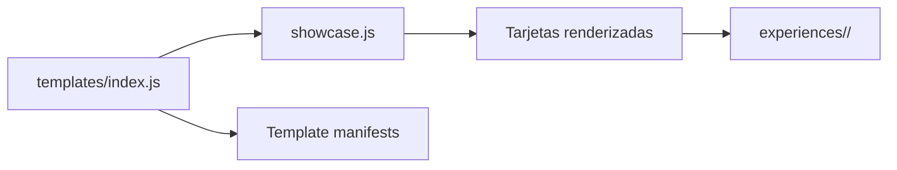

# Polaris Showcase

## Objetivo

Polaris Showcase es la página principal del repositorio. Permite descubrir y lanzar
todas las experiencias disponibles sin duplicar catálogos.

## Arquitectura

`index.html` contiene únicamente el shell y un `<template>` reutilizable.
`src/scripts/showcase.js` importa `templates`, crea una tarjeta accesible por entrada
y no conoce nombres de experiencias. `src/styles/showcase.css` aporta una interfaz
responsive y conserva áreas táctiles amplias.

## Registro central

La única lista autorizada está en `src/scripts/templates/index.js`. Cada registro
declara:

- `id`: slug único;
- `name`: nombre visible;
- `description`: resumen de la experiencia;
- `image`: vista previa o placeholder;
- `launchUrl`: ruta relativa publicable;
- `manifest`: contrato completo de la plantilla.

Para añadir una experiencia, se importa su manifiesto y se agrega una sola entrada.
El Showcase la renderiza automáticamente.

## Experiencias actuales

- Baby Shower Space: experiencia publicada preservada en su propia ruta.
- Wedding: recorrido de ocho escenas para Elena y Mateo.
- Santorini Birthday: primera experiencia editorial de Mediterranean Collection.
- Template Starter: referencia mínima ejecutable.

## GitHub Pages

Las rutas no usan `/` inicial ni history routing. La raíz presenta el Showcase y cada
botón abre un directorio con `index.html`, de modo que funciona tanto localmente como
en el subdirectorio de GitHub Pages.
